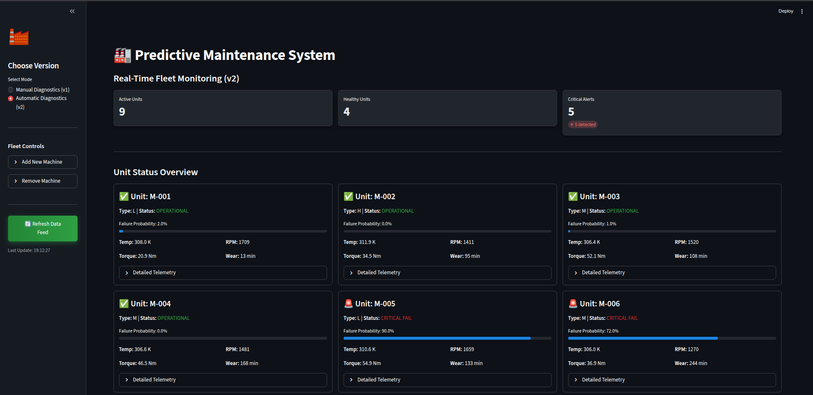

# 🛡️ AI-Powered Predictive Maintenance System

[](https://predictive-maintenance-system-sm14.streamlit.app/)
[](https://www.python.org/downloads/)
[](LICENSE)

A robust, AI-driven application designed to predict equipment failures before they occur. This project leverages machine learning (Random Forest) to analyze sensor data in real-time, helping industries optimize maintenance schedules, reduce downtime, and cut operational costs.

### 🔴 Live Demo: [Click Here](https://predictive-maintenance-system-sm14.streamlit.app/)

## 📸 Dashboard Previews

### 1. Manual Diagnostics Mode


### 2. Automatic Fleet Monitoring Mode


## 🚀 Key Features

*   **Dual Operation Modes:**
    *   **🛠️ Manual Diagnostics:** Deep-dive analysis for single units. Input sensor parameters manually to stress-test specific scenarios and visualize failure probabilities.
    *   **🏭 Automatic Fleet Monitoring:** Real-time dashboard simulating a fleet of 9+ industrial machines. Tracks live telemetry, failure risks, and operational status simultaneously.
*   **Intelligent Prediction Engine:** Powered by a trained **Random Forest Classifier** (`model.joblib`), achieving consistently high accuracy (>98%) in detecting potential failures.
*   **Real-time Feature Engineering:** Automatically calculates critical derived metrics like *Temperature Difference* and *Mechanical Power* on the fly.
*   **Professional UI/UX:** Dark-mode enabled, responsive design built with Streamlit, featuring interactive metric cards, visual health indicators, and dynamic alerts.

## 🧠 Model & Data

The predictive model is trained on a synthetic dataset mirroring real-world industrial sensor data (based on the **AI4I 2020 Predictive Maintenance Dataset**).

### Input Parameters (Sensors)
| Feature | Unit | Description |
| :--- | :--- | :--- |
| **Air Temperature** | [K] | Ambient room temperature. |
| **Process Temperature** | [K] | Temperature of the manufacturing process. |
| **Rotational Speed** | [rpm] | Speed of the spindle/drive. |
| **Torque** | [Nm] | Torque applied during operation. |
| **Tool Wear** | [min] | Cumulative tool wear time. |
| **Type** | L/M/H | Quality variant (Low, Medium, High). |

### Output (Prediction)
*   **No Failure:** ✅ System Healthy
*   **Failure:** 🚨 Maintenance Required (Probability > 50%)

## 🛠️ Installation & Setup

Follow these steps to set up the project locally.

### 1. Clone the Repository
```bash
git clone https://github.com/ShivamMaurya14/Predictive-Maintenance-System.git
cd Predictive-Maintenance-System
```

### 2. Create a Virtual Environment (Optional but Recommended)
```bash
python -m venv venv
source venv/bin/activate  # On Windows: venv\Scripts\activate
```

### 3. Install Dependencies
Ensure you have Python 3.8+ installed.
```bash
pip install -r requirements.txt
```

> **Note:** If `requirements.txt` is missing, install the core libraries:
> `pip install streamlit pandas numpy scikit-learn joblib`

### 4. Training the Model (Optional)
The project comes with a pre-trained model (`model.joblib`). If you wish to retrain it:
```bash
python retrain_model.py
```
*This will create a fresh `model.joblib` file in your directory.*

### 5. Run the Application
Launch the dashboard in your browser.
```bash
streamlit run app.py
```

## 📂 Project Structure

```
├── app.py                 # Main Streamlit Application (Frontend)
├── retrain_model.py       # ML Model Training Script (Backend logic)
├── model.joblib           # Serialized Random Forest Model
├── requirements.txt       # Python Dependencies
├── LICENSE                # MIT License
├── .gitignore             # Git ignore file
└── README.md              # Project Documentation
```

## 🏭 Industry Applications

This predictive maintenance solution is versatile and can be adapted across various high-stakes industries:

*   **Manufacturing & Assembly Lines:** Monitor robotic arms, conveyor motors, and CNC machines to prevent production bottlenecks.
*   **Energy & Utilities:** Track turbine health in wind farms or pumps in hydroelectric plants to avoid catastrophic failures.
*   **Transportation & Logistics:** Fleet management for heavy trucks or railway rolling stock, ensuring safety and reliability.
*   **Oil & Gas:** Predictive analytics for drilling equipment and pipeline pressure valves in remote locations.
*   **Data Centers:** Monitor cooling systems and power generators to maintain 99.9% uptime.

## 🔮 Future Scope & Roadmap

We are constantly evolving to meet Industry 4.0 standards. Here is our vision for the future:

### 🔗 Phase 1: Real-Time Integration
*   **IoT & MQTT Connectivity:** Direct integration with industrial IoT standards (MQTT/OPC UA) to ingest live sensor streams from PLC controllers.
*   **Edge Deployment:** Optimizing the model to run on edge devices (Raspberry Pi/Jetson Nano) for ultra-low latency predictions without cloud dependency.

### 💾 Phase 2: Enterprise Scalability
*   **Time-Series Database (InfluxDB):** High-performance storage for historical sensor data to enable long-term trend analysis.
*   **API Gateway:** Expose prediction results via a RESTful API for integration with existing ERP (SAP/Oracle) or MES systems.

### 🧠 Phase 3: Advanced Intelligence
*   **Deep Learning (LSTM/GRU):** Experimenting with Recurrent Neural Networks to capture complex temporal dependencies in sensor patterns.
*   **Root Cause Analysis:** Automatic identification of *which* sensor triggered the failure alert (e.g., "High vibrations caused bearing failure").
*   **Digital Twin:** Creating a fully interactive 3D digital twin of the factory floor using Unity or Three.js linked to this backend.

## 🤝 Contributing

Contributions are welcome! Please fork the repository and submit a pull request for any enhancements, bug fixes, or new feature ideas.

---
**Developed with ❤️ by Shivam Maurya**
